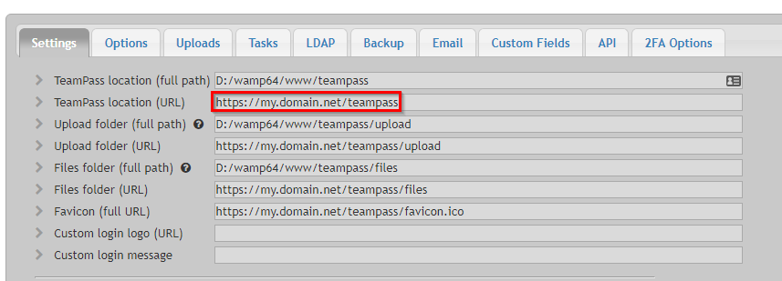
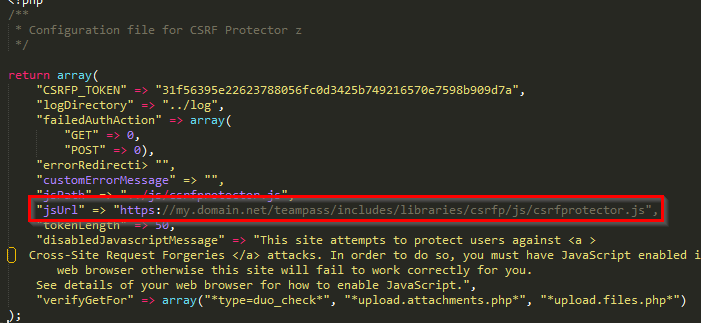
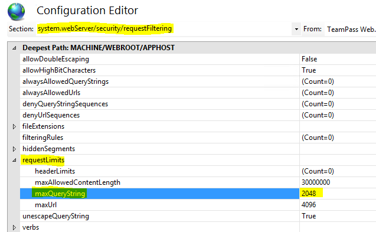

## Error 403 / 500, blank page, ...

Teampass comes with csrfProtector that protects against Cross Site Request Forgery mechanisms. Due to this, you must ensure that your Teampass configuration is consistent between all paths.

In this example, we will assume that Teampass is hosted at `https://my.domain.net/teampass`.

Check the next 2 topics and ensure consistency between the paths you are using.

### Teampass settings

* Open the `Settings` page (https://my.domain.net/teampass/index.php?page=manage_settings)
* Fill in the four (4) URL fields with the correct URL the users will use.

> Don't use any redirection. Use only the correct URL in those settings. Otherwize csrfProtector will consider this as an inconsistency and will raise an error.

### CSRFProtector settings

* With a shell, open file `<path to teampass folder>/includes/libraries/csrfp/libs/csrfp.config.php`
* Check variable `jsUrl`, it must contain the complete URL too.

## Users and Folders lists are empty

The symptom is when opening the page `Manage Users` or `Manage Folders`, the page is shown but the list is empty.

**Conditions:**

* Server is **IIS**
* Error identification shows "query string was too long"

**Solution:**

Increase the `maxQueryString` config value from 2048 (default) to **4096**. 

* Open the website in IIS Manager
* Click Configuration Editor
* Browse to the **system.webServer/security/requestFiltering** section at the top
* Click **requestLimits** in the table below
* Identify **maxQueryString** value

