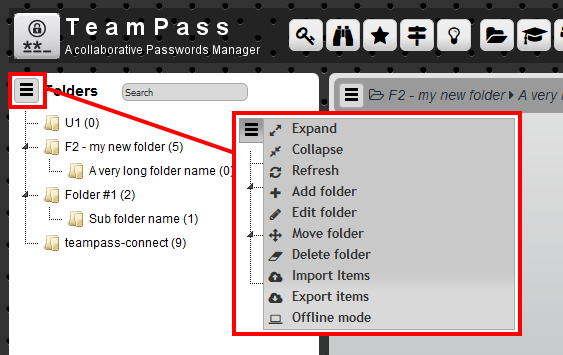
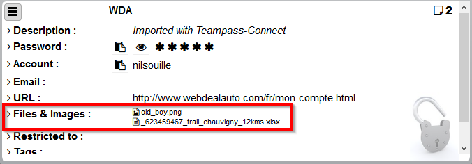
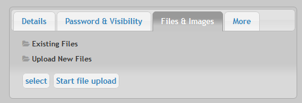
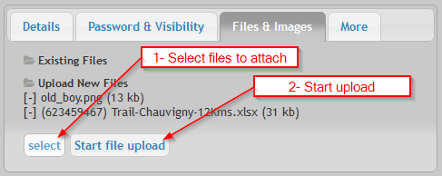
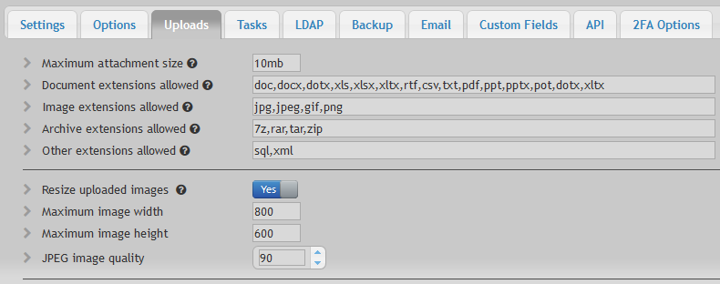
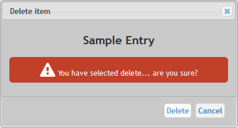
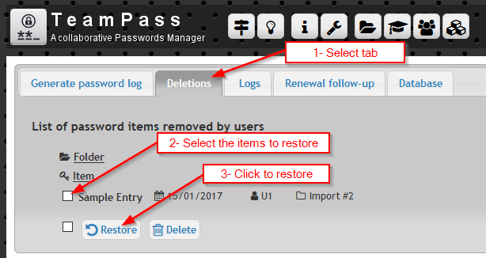
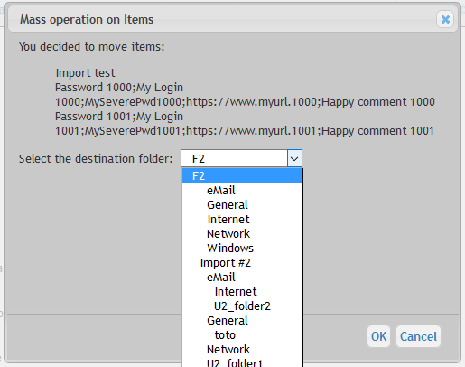
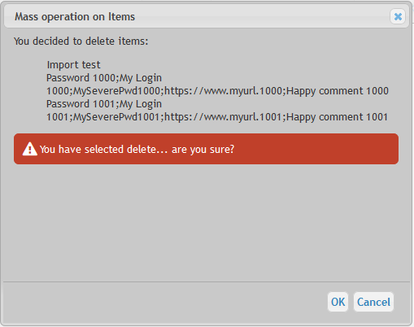

# Items

The main page is the one the users will access and handle the Items.

The main screen is devided in 3 main parts. Each of those parts has its own sub menu which allows to perform specific actions on Folders and Items.

# Folders tree

The `Folders Tree` shows the folders the user is allowed to see and access.

> Click a Folder to see the related Items.

Clicking the Folders Menu brings up a list of possible actions. The actions list is depending on the enabled options.

# Items list

Contains the Items stored in the selected Folder. The list shows the Item label and the Description. For each Item, small icons are displayed permitting to quickly perform actions on the items such as copying in clipboard `Password` and `Login` (if enabled).

If allowed to, the user can make a drag and drop to move the Item to another folder.

# Item details

Displays the details for the selected Items.

The Item detail area permits the user to see all data related to an Item.

# Searching Items

You can perform a search inside a specific page.

The Items are shown in a table format in which you can perform a search using a criteria. This criteria performs the search inside several fields.

# Attach files to Item

You can attach files to your item. In case it is an image, Teampass displays it through a Viewer.

To attach files,

* select tab `Files & Images`

* Click `Select` and select the files to attach
* Click `Start file upload` to upload the selected files.

* Now save

Several options can be defined by Administrator to fit security rules.
It is possible to:

* limit the files extension 
* limit the maximum size of an attached file
* resize the image

# Delete an Item

You can delete an Item. To do so:
* select the Item
* do a click on the top Item menu button
* select "Delete item"

* confirm deletion

> A Deleted item is only disabled and not deleted from the database. It is possible to restore it unless it has been purged.

# Restore an Item

A deleted item can be either restore back to its previous position, either purged away.

To do so:
* be logged as a Manager or Administrator
* select `Utilities` view

* select tab `Deletion`
* select the Items to Restore or Delete
* click button corresponding to your choice

> If you decide to Delete, the selected Items will be purged from the database.

> If you decide to Restore, the selected items will be restored at their previous position.

# Mass move & delete

[Introduced in 2.1.27]

Mass operation permits to select a set of Items and perform a common action on them. Currently, you may either `Move` or `Delete` a selection of Items.

This feature is only allowed if the setting `Allow user to perform massive move and delete operations` is set to **Yes**.

Performing mass operation is possible from the page called `Find`.

When the user has the right to either move or delete an item, a checkbox is added in front of its label.

You may select as many items you want.

Using the icons, you can decide to launch the action you want.

## Moving items

Select the destination folder and click on OK button.

Wait until the dialogbox is closed.

## Deleting items

Confirm the deletion by clicking on OK button.

Wait until the dialogbox is closed.
