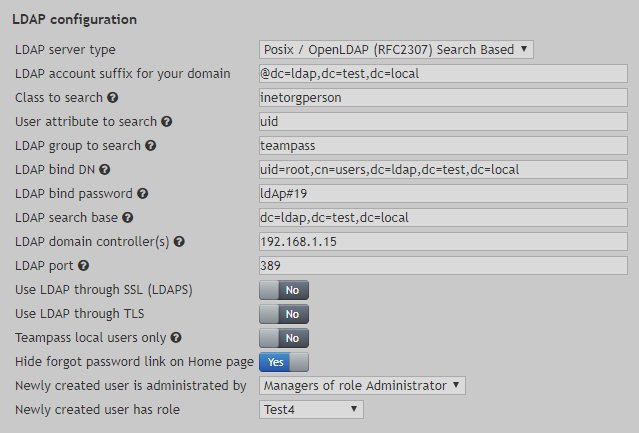

# LDAP configuration

Users authentication can be done through LDAP.

Teampass proposes the next setups:
- Windows / Active Directory
- Posix / OpenLDAP (RFC2307)
- Posix / OpenLDAP (RFC2307) Search Based

This page describes the setup using `Posix / OpenLDAP (RFC2307) Search Based`.

The next settings form is given as an example

This should be adapted to fit your LDAP server configuration

## Settings

`LDAP account suffix for your domain`
> Using the LDAP server FQDN prefixed with @ symbol.
In our case the FQDN is `ldap.test.local`.

`Class to search`
> Use inetorgperson for example.

`User attribute to search`
> Use the attribute used in your ldap server to identify users. Could be set to `iud`.

`LDAP group to search`
> Is optional. Leave it empty if users in any LDAP groups can authenticate in Teampass.
If you want to restraint the authentication in Teampass to a specific LDAP group, indicate it here.
As an example, you could define a LDAP group called `teampass` and indicate it here.

`LDAP bind DN`
> The bindDN DN is basically the credential you are using to authenticate against an LDAP.

`LDAP bind password`
> The bindDN usually comes with a password associated with it.

`LDAP search base`
> Indicate the LDAP tree to be used as base to perform search.
In our case, we indicated the full tree.

`LDAP domain controller(s)`
> Specify the domain to reach your LDAP. If you have several domains, you may indicate them separated by a comma symbol.

`LDAP port`
> This is the port for reaching your LDAP server.

`Newly created user is administrated by`
> Indicate what manager will be in charge of administrating a newly created user.

`Newly created user has role`
> Indicate what Role inherits the user when its account is created.

## More debug

If you cannot made testing connection successfull, you can enable a debug mode that will generate a debug text file.

To do so:

- open file `/sources/identify.php`
- search for `$debugLdap = 0;` at the top of the file
- change its value from `0` to `1`
- try to log
- open the generated log file `/files/ldap.debug.txt`
- identify possible issue
