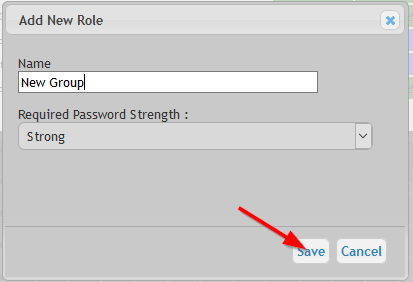
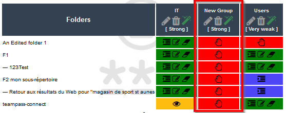
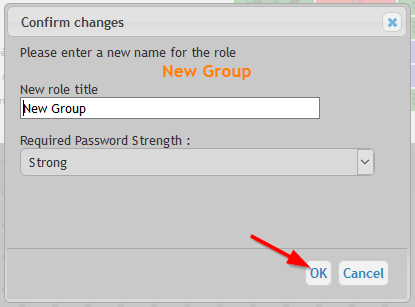
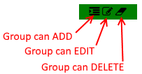
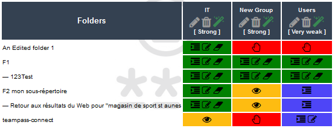

# Manage the Groups

A Group contains a set of Users. It simplifies the administration of access rights on Folders.
Indeed access rights on Folders are defined by Groups. 

A good practice is to organize the Users Group by team or groups of interest.

	Notice that a User may be associated to several User Groups.

# Example

Let's consider 3 Users (Us1, Us2 and Us3), 2 Folders (Fld1 and Fld2), and 2 Users Group (UG1 and UG2) defined as below:

* UG1 contains Us1, Us2 and Us3. It is associated to Fld2
* UG2 contains Us2. It is associated to Fld1

Based on this assumption, Us2 is the unique user to have access to both Fdl1 and Fld2.

# Access to Group Management page

Access to the `Group Management` page.

# Creating a new Group

Click the icon `Add a Group`

And fill in the form

About the form:

* The label is the name of the Group.
* The `Required complexity` corresponds to the minimum password complexity level that a User password (that belong to this Group) needs to fulfill.

The new Group is now added to the list.

# Edit a Group

To edit, click the `edit icon`.

And edit it through the dialog box

# Delete a Group

To delete, click the `edit icon` and Confirm.

	Users belonging to this Group will need to be associated to another Group.

# Using the rights matrix

The `rights matrix` permits to allow or deny the access of Users in a Group to Folders.

To ease its understanding, the `rights matrix` uses colors and icons to indicate the specific rights set for a Group on a Folder.

* `Red` cell indicates that the Group is not allowed to access the folder
* `Yellow` cell indicates that the Group is allowed to View only
* `Green` cell indicates that the Group has access to the Folder
* `Blue` cell indicates that the Group has access to the Folder but with specific restrictions

Small icons indicate the restrictions in place for a Group on a Folder.

This matrix is very powerful and visible. As you can see in the previous screen-capture.

# Allow access to all Items

This feature is disabled by default and is unsecure but it may be helpful.

Its aim is to permit the Users of a Group to have the right to edit/modify all Items they have access to.
It will bypass the settings set for each Item.

	Only activate this for a Group with limited Users.

To activate this, click on the icon as shown in next screen-capture.

# Who can manage Groups

Creation, modification and deletion can only be performed by an `Administrator` or a `Manager`.

Notes:

* The Manager will only see the Group that he is associated to.
* Deleting a User Group will not delete the associated Users.
